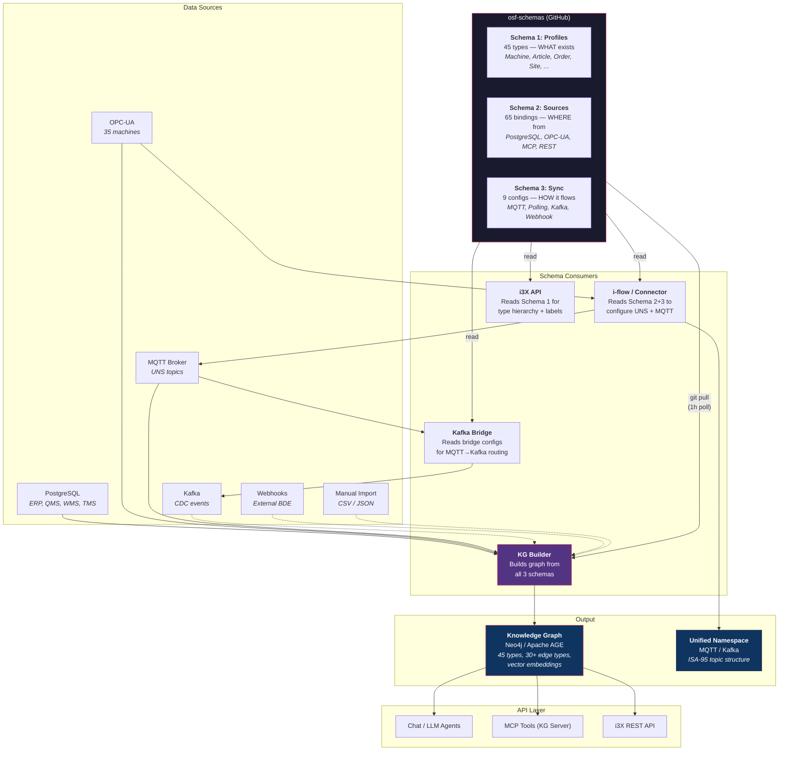

# OSF Schemas

3-Schema system for the OpenShopFloor Knowledge Graph. The KG Builder pulls this repo and automatically constructs a Neo4j/Apache AGE Knowledge Graph — no LLM, no manual graph construction.

## OSF vs. CESMII SM Profiles

OSF schemas are inspired by [CESMII Smart Manufacturing Profiles](https://www.cesmii.org/) but extend them for Knowledge Graph construction:

| Aspect | CESMII SM Profile | OSF SM Profile |
|--------|------------------|----------------|
| **Purpose** | Type definition for equipment/data | Type definition + KG build instructions |
| **Output** | Flat instance model | Graph with nodes, edges, labels |
| **Inheritance** | `parentType` for type hierarchy | `parentType` with attribute + relationship merge at load time |
| **Abstract types** | Not supported | `"abstract": true` — skip index creation for parent-only types |
| **Data binding** | Separate configuration | Schema 2 (Sources) — PostgreSQL, OPC-UA, MCP, REST |
| **Live sync** | Platform-specific | Schema 3 (Sync) — MQTT, Polling, pg-notify, Kafka, Webhook |
| **Graph semantics** | No graph concept | `kgNodeLabel`, `kgIdProperty`, `relationships[]` with `targetIdProp` polymorphism |
| **Multi-source** | One profile = one source | One profile, N sources (5 ERPs through acquisitions? No problem) |
| **i3X API** | REST API on SMIP platform | REST API on Knowledge Graph (Gateway routes) |

**Key advantages of the OSF approach:**

1. **Source-agnostic graph** — The KG fuses data from PostgreSQL, OPC-UA, MQTT, Kafka, REST, MCP into one graph. The i3X API queries the graph, never a source directly. Whether data came from SAP, a CSV import, or an OPC-UA server doesn't matter.

2. **Polymorphic edge resolution** — `targetIdProp: "machine_id"` automatically resolves to all profile types sharing that ID property. Add a new machine type → all existing edges find it without source schema changes.

3. **Schema-driven, not code-driven** — Change a JSON file, push to GitHub. The KG Builder rebuilds. No recompilation, no redeployment.

4. **Inheritance reduces duplication** — 8 machine types share 18 BDE attributes from one parent. 112 redundant attribute definitions eliminated.

## Data Flow

The 3 schemas are the **single source of truth** for the entire data pipeline — not just the KG Builder, but any system that needs to know what exists, where data comes from, and how it flows.



**Key insight:** The schemas define the data model once. Multiple systems consume them:
- **KG Builder** reads all 3 schemas → builds the graph
- **i-flow / OPC-UA Connectors** read Schema 2 (sources) + Schema 3 (sync) → configure UNS topics and MQTT publishing
- **Kafka Bridge** reads bridge configs → routes MQTT messages to Kafka topics
- **i3X API** reads Schema 1 (profiles) → serves type hierarchy and object queries

Dashed lines (- - -) indicate planned but not yet implemented data flows.

## Structure

```
profiles/                        Schema 1: SM Profiles (type system)
  enterprise/                    ISA-95 hierarchy (Enterprise, Site, Area, ProductionLine, System)
  machines/                      Machine types + abstract parent (Machine, CNC, IMM, FFS, ...)
  erp/                           ERP domain (Article, Order, Customer, Supplier, BOM, ...)
  maintenance/                   Maintenance (MaintenanceOrder, DowntimeRecord, ...)
  qms/                           Quality (InspectionLot, QualityNotification, SPC, ...)
  wms/                           Warehouse (GoodsReceipt, TransportOrder, Quant, ...)

sources/                         Schema 2: Data Sources (instance binding)
  postgresql/                    30 PostgreSQL table mappings (ERP, QMS, WMS)
  opcua/                         35 OPC-UA machine mappings

sync/                            Schema 3: Live Sync (transport layer)
  mqtt/                          MQTT UNS subscriptions (ISA-95, shared UNS)
  polling/                       PostgreSQL polling (ERP, QMS, WMS — timestamp/full refresh)
  kafka/                         Kafka consumer configs (event-driven CDC)
  webhook/                       REST webhook endpoints (external BDE push)
  manual/                        Manual import configs (CSV/JSON one-off loads)
  bridge/                        Bridge configs (MQTT→Kafka aggregation, reference only)
```

## Inheritance

Profiles support `parentType` inheritance. The KG Builder merges parent attributes and relationships into children at load time. Child definitions override parent on name collision.

```
Machine (abstract)               18 BDE/OEE attributes, 3 relationships
├── CNC_Machine                  inherits all, no own attributes
├── MillingMachine               inherits all, no own attributes
├── Lathe                        inherits all, no own attributes
├── GrindingMachine              inherits all, no own attributes
├── FiveAxisMillingMachine        inherits all, no own attributes
├── AssemblyLine                 inherits all, custom relationships (ASSEMBLES, CONSUMES)
├── FFS_Cell                     inherits all + 5 CNC-specific attrs (Spindle, Feed, GCode)
└── InjectionMoldingMachine      inherits all + 90 ISA-88 process params

Order (abstract)                 order_no, status
├── CustomerOrder                7 own attrs (customer, quantity, due_date, ...)
├── ProductionOrder              overrides status as Int32 enum [1-5], 10 own attrs
├── PurchaseOrder                6 own attrs (supplier, delivery dates, ...)
└── MaintenanceOrder             8 own attrs (priority, planned hours, ...)
```

Abstract parents (`"abstract": true`) skip index creation — no sources create instances for them directly. The parent label is applied to child nodes via `applyParentLabels()` (e.g., all CNC_Machine nodes also get `:Machine`).

## Quick Start

1. Add a profile: `profiles/<domain>/<type>.json`
2. Add a source: `sources/postgresql/<source>.json` with `profileRef` pointing to your profile
3. Optionally add sync: `sync/mqtt/<sync>.json` or `sync/polling/<sync>.json`
4. Push to `main` — the KG Builder picks up changes within 1 hour

## Documentation

See [schema-guide.md](schema-guide.md) for the full documentation.
