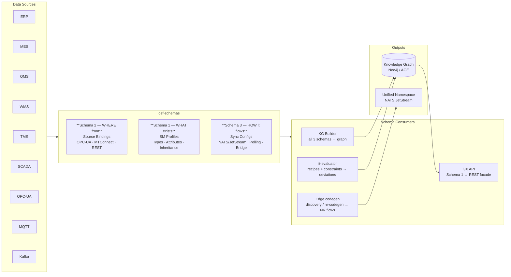

# OSF Schemas

3-Schema system for the OpenShopFloor Knowledge Graph. The KG Builder pulls this repo and automatically constructs a Neo4j/Apache AGE Knowledge Graph — no LLM, no manual graph construction.

## OSF vs. CESMII SM Profiles

OSF schemas are inspired by [CESMII Smart Manufacturing Profiles](https://www.cesmii.org/) but extend them for Knowledge Graph construction:

| Aspect | CESMII SM Profile | OSF SM Profile |
|--------|------------------|----------------|
| **Purpose** | Type definition for equipment/data | Type definition + KG build instructions |
| **Output** | Flat instance model | Graph with nodes, edges, labels |
| **Inheritance** | `parentType` for type hierarchy | `parentType` with attribute + relationship merge at load time |
| **Abstract types** | Not supported | `"abstract": true` — skip index creation for parent-only types |
| **Data binding** | Separate configuration | Schema 2 (Sources) — OPC-UA, MTConnect, REST |
| **Live sync** | Platform-specific | Schema 3 (Sync) — NATS/JetStream, REST polling, OPC-UA-server bridge |
| **Graph semantics** | No graph concept | `kgNodeLabel`, `kgIdProperty`, `relationships[]` with `targetIdProp` polymorphism |
| **Multi-source** | One profile = one source | One profile, N sources (5 ERPs through acquisitions? No problem) |
| **i3X API** | REST API on SMIP platform | REST API on Knowledge Graph (Gateway routes) |

**Key advantages of the OSF approach:**

1. **Source-agnostic graph** — The KG fuses data from OPC-UA, MTConnect and REST sources into one graph. The i3X API queries the graph, never a source directly. Whether data came from an ERP REST projection, an MTConnect agent or an OPC-UA server doesn't matter. (The v3-era PostgreSQL/MQTT/Kafka/MCP ingestion paths are archived under `backup/pre-next2.0/` — no service loads them.)

2. **Polymorphic edge resolution** — `targetIdProp: "machine_id"` automatically resolves to all profile types sharing that ID property. Add a new machine type → all existing edges find it without source schema changes.

3. **Schema-driven, not code-driven** — Change a JSON file, push to GitHub. The KG Builder rebuilds. No recompilation, no redeployment.

4. **Inheritance reduces duplication** — machine types share one abstract `Machine` parent that carries the identity (`machine_id`) and the machine-level relationships (`EXECUTES`, `PART_OF`, `PRODUCES`); every child (`CNC_Machine`, `InjectionMoldingMachine`) adds only its own attribute set and is found by every existing `targetIdProp: "machine_id"` edge.

## Data Flow

The 3 schemas are the **single source of truth** for the entire data pipeline — not just the KG Builder, but any system that needs to know what exists, where data comes from, and how it flows.



(The counts deliberately do **not** live in this diagram — they drift. The measured
numbers are in the generated [Counts](#counts) block below.)

**The schemas define the data model once — multiple systems consume them:**

| Consumer | Reads | Produces |
|----------|-------|----------|
| **KG Builder** | All 3 schemas | Knowledge Graph (nodes, edges, embeddings) |
| **Edge codegen** (discovery / nr-codegen) | `mappings/` + `sources/` + `sync/nats/` + `historians/` | Node-RED flows, JetStream publishes, historian writers |
| **JetStream provisioning** (`provision-jetstream.sh`) | `sync/nats/jetstream-streams.json` | streams + consumers on edge/hub NATS |
| **it-evaluator** | `recipes/` (runtime fetch) + constraint facets | deviations, capability verdicts (Cp/Ca) |
| **i3X API** | Schema 1 (profiles) | REST API with type hierarchy |

(The v3-era consumers of `sources/postgresql/` and `sync/mqtt|kafka|webhook|manual|bridge/`
are retired; those configs live under `backup/pre-next2.0/`.)

## Structure

<!-- gen:tree:begin -->
```
osf-schemas/
├── backup/                 ARCHIVED (v3-era postgresql sources, mqtt/kafka/webhook/manual/bridge syncs; it-fleet) — reference only, loaded by nothing (327 json)
├── branding/               brand/theme assets (1 json)
├── ci/                     linters + generators (lint-*.mjs, gen-contract.mjs, gen-docs.mjs)
├── companion-specs/        OPC-UA Companion-Spec registry (NodeSet2.xml URLs) (1 json)
├── cross-constraints/      cross-profile discrepancy constraints (PLAN vs IST rules) (4 json)
├── docs/                   conventions, next2.0 standard, agent-conformance, variable shapes
├── examples/               demo fixtures — NOT canonical (see examples/README.md) (5 json)
├── flows/                  Node-RED flow templates (OPC-UA → UNS standard flow) (1 json)
├── historians/             historian-sink templates + instances (OUTPUT: UNS → customer DB)
│   ├── central-ts-tables/       (2 json)
│   ├── grafana-dashboards/      (4 json)
│   ├── influxdb/                (1 json)
│   ├── instances/               (4 json)
│   ├── mssql/                   (1 json)
│   ├── nats-jetstream/          (1 json)
│   ├── postgresql/              (1 json)
│   ├── postgresql-cagg/         (1 json)
│   ├── postgresql-pivot/        (1 json)
│   └── views/                   (1 json)
├── kpis/                   KPI definitions — inputs drawn from the source-fed vocabulary (lint-kpis) (6 json)
├── mappings/               protocol canon: DataItem/tag → SM attribute (SSOT for discovery + gen-flows) (2 json)
├── profiles/               Schema 1: SM Profiles (type system)
│   ├── equipment/              EquipmentClass, EquipmentModel (compact), Tool (3 json)
│   ├── erp/                    Article, Customer(-Order), ProductionOrder, ProductDefinition, OperationsResponse (6 json)
│   ├── intelligence/           multi-truth layer: Discrepancy, ResolutionProposal, AutoResolveRule, … (4 json)
│   ├── machines/               Machine (abstract parent), CNC_Machine, InjectionMoldingMachine (3 json)
│   ├── operations/             ISA-95 Part 4: OperationsDefinition, ProcessSegment, Segment{Requirement,Response}, Workorder (5 json)
│   ├── qms/                    InspectionLot, SPCAnalysis (2 json)
│   └── wms/                    MaterialLot, Quant, StorageLocation (3 json)
├── recipes/                GitHub-managed recipe master data (see recipes/README.md) (3 json)
├── sources/                Schema 2: Data Sources (instance binding)
│   ├── mtconnect/              MTConnect agent mappings (2 json)
│   ├── opcua/                  OPC-UA endpoint → machine mappings (11 json)
│   └── rest/                   sim-v5 REST polling (ERP/QMS/WMS projections) (9 json)
├── sync/                   Schema 3: Live Sync (transport layer)
│   ├── nats/                   NATS subjects + JetStream stream declarations (suite hub) (2 json)
│   ├── opcua-server/           Sonder-Edge re-publish (MTConnect → embedded OPC-UA server) (1 json)
│   └── polling/                REST polling schedule (1 json)
├── unit-conversions/       UNECE unit table (discovery-time scale/offset lookup) (1 json)
├── validation/             ajv meta-schemas (per-file shape validation) (17 json)
├── CLAUDE.md               agent instructions
├── contract.json           GENERATED ontology contract (gen-contract.mjs) — agents read this FIRST
├── README.md               this overview
└── schema-guide.md         the full schema documentation
```
<!-- gen:tree:end -->

### Counts

<!-- gen:counts:begin -->
| Category | Count | Files |
|---|---|---|
| Profiles | 26 | equipment 3 · erp 6 · intelligence 4 · machines 3 · operations 5 · qms 2 · wms 3 |
| Sources — mtconnect | 2 | mtconnect-cnc-01, mtconnect-cnc-mtc-02 |
| Sources — opcua | 11 | opcua-cnc-001-event, opcua-cnc-001-telemetry, opcua-cnc-002-event, opcua-cnc-002-telemetry, opcua-mtbridge-cnc-01, opcua-sgm-001-event, opcua-sgm-001-telemetry, opcua-sgm-004-processdata, opcua-sgm-005-processdata, opcua-sgm-006-bde, opcua-sgm-006-processdata |
| Sources — rest | 9 | erp-customer-orders, erp-operations-response, erp-production-orders, erp-segment-requirements, erp-segment-responses, sim-v5-erp-articles, sim-v5-erp-customers, sim-v5-qms-inspections, sim-v5-wms-quants |
| Sync — nats | 2 | jetstream-streams, opcua-to-nats-cnc-mtc-01 |
| Sync — opcua-server | 1 | mtconnect-to-opcua-cnc-mtc-01 |
| Sync — polling | 1 | sim-v5-poll |
| Recipes | 3 (2 parked) | recipe-sgm-004-default, recipe-sgm-004-pa66gf30-bracket-b *(parked)*, recipe-sgm-004-pa66gf30-housing-a *(parked)* |
| KPIs | 6 (2 parked) | availability, energy-per-part *(parked)*, oee, performance *(parked)*, quality-rate, scrap-rate |

Measured from the tree by `ci/gen-docs.mjs` — the same sums `npm run validate:refs` prints (`lint-refs: 26 profiles, 22 sources, 4 sync files`).
<!-- gen:counts:end -->

## Inheritance

Profiles support `parentType` inheritance. The KG Builder merges parent attributes and relationships into children at load time. Child definitions override parent on name collision.

```
Machine (abstract)               identity + relationship parent: machine_id,
│                                EXECUTES / PART_OF / PRODUCES — no attributes of its own
├── CNC_Machine                  adds the CNC attribute set (BDE/OEE + spindle/feed/program)
└── InjectionMoldingMachine      adds the ISA-88 process-parameter set + USES_TOOL
```

That is the whole inheritance tree today. There is **no** abstract `Order`
parent on the ERP side — `CustomerOrder` and `ProductionOrder` are independent
profiles linked by `TRIGGERS`/`TRIGGERED_BY` edges (see `contract.json`), and
profiles like `PurchaseOrder`/`MaintenanceOrder` do not exist in this catalog.

Abstract parents (`"abstract": true`) skip index creation — no sources create instances for them directly. The parent label is applied to child nodes via `applyParentLabels()` (e.g., all CNC_Machine nodes also get `:Machine`).

## Promotion cadence

Every attribute carries a per-attribute `promotion` field — the single,
**edge-agnostic** emission-cadence control. **The IT edge** (business entities,
`it-edge`) **and the OT edge** (machine telemetry, `discovery`/`nr-codegen`)
**read and honor `promotion` identically**: the same `(attribute, promotion)`
pair produces the same emit decision on both edges.

**Full vocabulary**

| Value | Cadence |
|-------|---------|
| `raw` | (OT) every sample to the local edge Timescale; (IT) payload-only, not a trigger |
| `aggregate` | edge 5-minute bucket (durations/counts only); not a trigger |
| `on_change` | emit when this attribute changes — the **only** change-trigger value |
| `on_cycle_end` | once per completed machine cycle (Class-B snapshot); not a trigger |
| `on_event` | event-driven; not a simple-field change-trigger |
| `never` | never emits on its own — kept in the snapshot/payload but **excluded from the change-trigger** (use for volatile server timestamps like `updated_at`) |
| `<N>sec` / `<N>min` | periodic emission every N seconds / minutes |

**Token grammar.** A `promotion` value is one of the enum tokens above **or** an
interval token matching the canonical regex `^[0-9]+(sec|min)$` — canonical form
`Nsec` / `Nmin`, `N >= 1` (`0sec`/`0min` are rejected by the edge parser).

**Change-trigger rule (storm fix).** An entity/variable emits an `updated` event
**only when at least one of its `on_change` attributes actually changed**;
`never` (and `raw`/`aggregate`/`on_cycle_end`/`on_event`) attributes are diffed
out of the trigger, so a volatile `updated_at:never` that the source returns
fresh on every read no longer emits anything.

See [schema-guide.md](schema-guide.md) → *`promotion` — emission cadence* for the
periodic-emit rule and valid combinations.

## Quick Start

1. Add a profile: `profiles/<domain>/<type>.json`
2. Add a source with `profileRef` pointing to your profile: `sources/rest/<source>.json`
   (business entities, REST polling) or `sources/opcua|mtconnect/<machine>.json` (OT)
3. Wire sync: REST sources get a `sourceRef` entry in `sync/polling/sim-v5-poll.json`;
   OT sources ride the NATS/JetStream path declared in `sync/nats/`
4. Regenerate the derived artefacts: `node ci/gen-contract.mjs && node ci/gen-docs.mjs`
5. `npm run validate` must be green, then push to `main` — the KG Builder picks up changes within 1 hour

## Documentation

See [schema-guide.md](schema-guide.md) for the full documentation.
